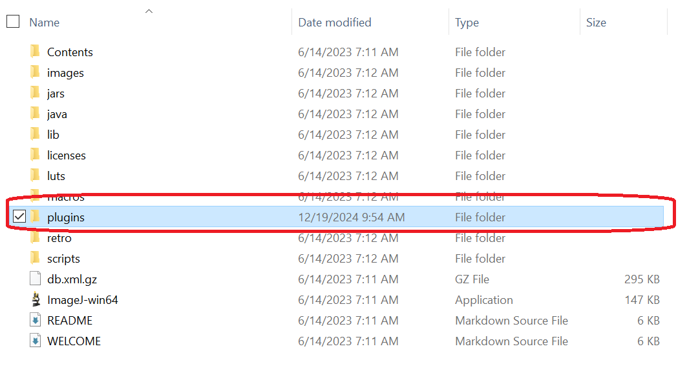
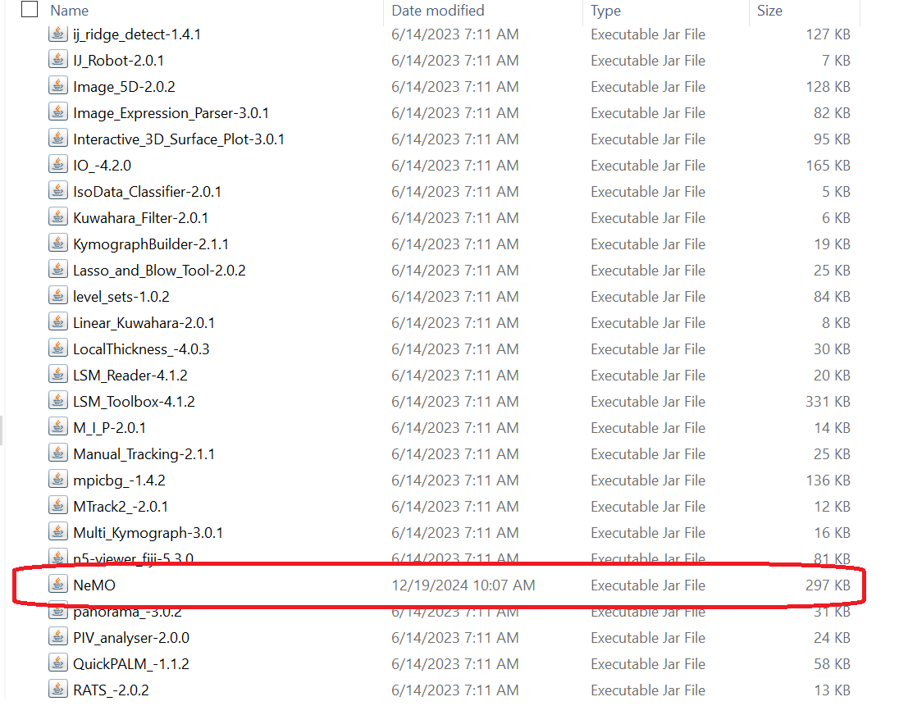
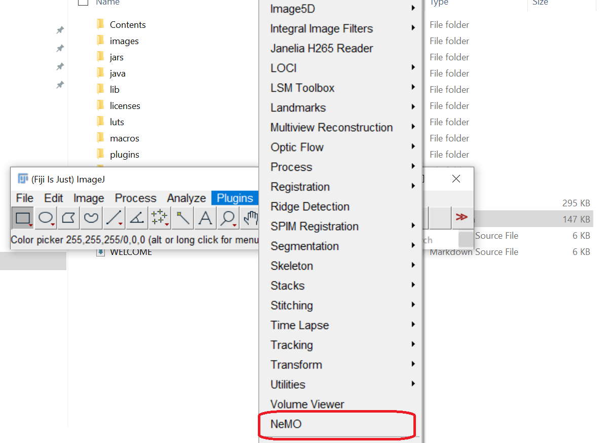
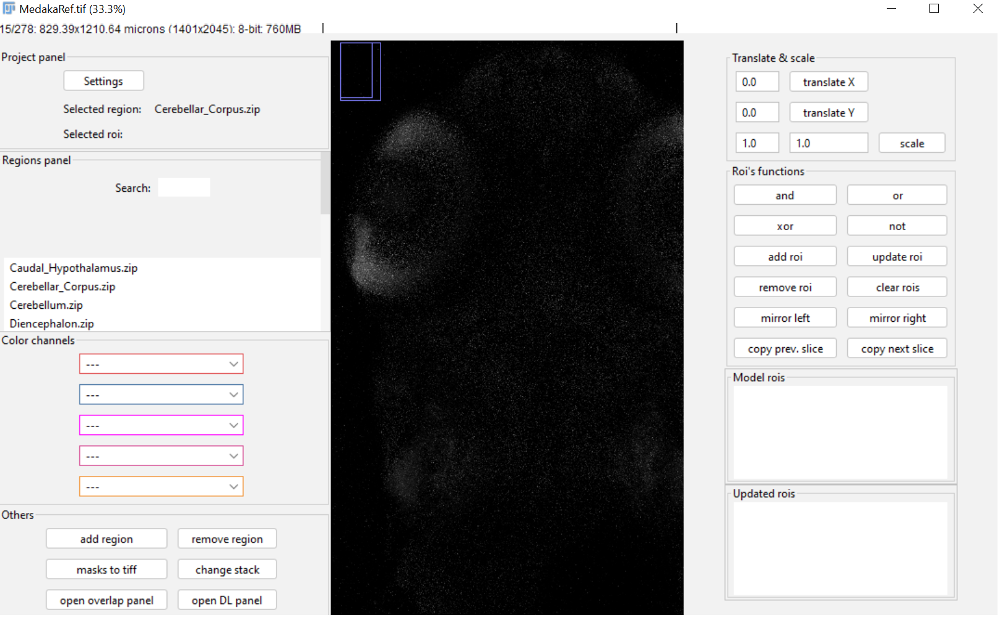

# NeMO Fiji Plugin

Neuro Mask Organizer (NeMO) is a Fiji plug-in for segmentation of anatomical masks. Fiji is an open source image processing software that is widely used in biology. The NeMO software specifically enables users to manually label anatomical masks, compare them to registered/predicted masks and correct the overlap between the masks. The software also allows users to combine manual labeling with a deep learning approach. The training dataset can be generated based on different parameters, including classification strategy (binary/multi-class), split strategy (train/test vs. train/validate/test), and training on whole images or patches. 

System requirements
The minimal requirements for running NeMO are:
1. Memory: 16-32 GB
2. Operating system: Windows 10+11, Linux, MacOS
3. Processor: 32-64 bit
4. Latest version of Fiji 
Installation instructions

Download the “NeMO.jar” from the github repository and copy it to the Fiji “plugins” directory (encircled red in the images below).

Open the Fiji platform and the NeMO plugin will be enlisted in the Fiji “plugins” tab (encircled red in the image below). 

Download the demo project and unzip it. Click the “NeMO” button and select the project file from the unzipped test project. The project will be loaded and the NeMO window will appear on the screen as shown below.

