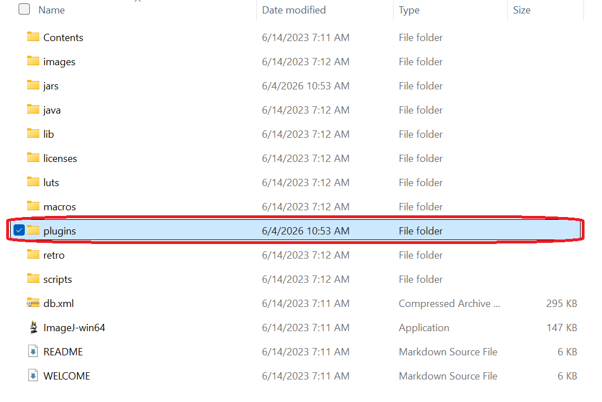
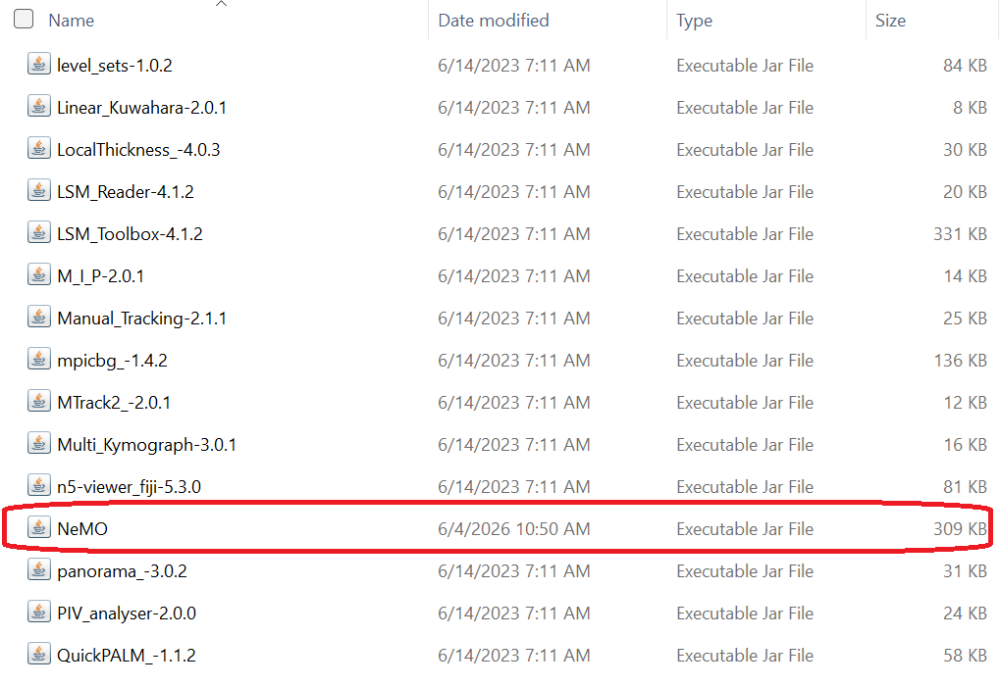
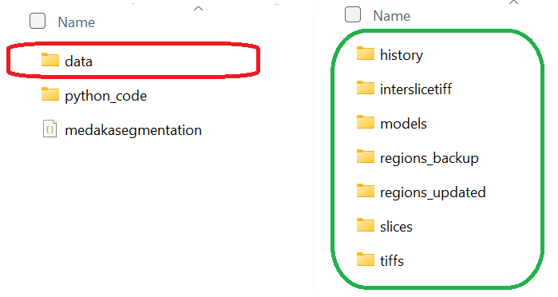
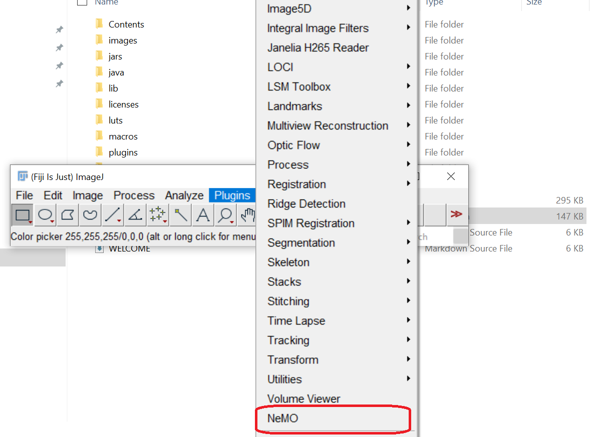
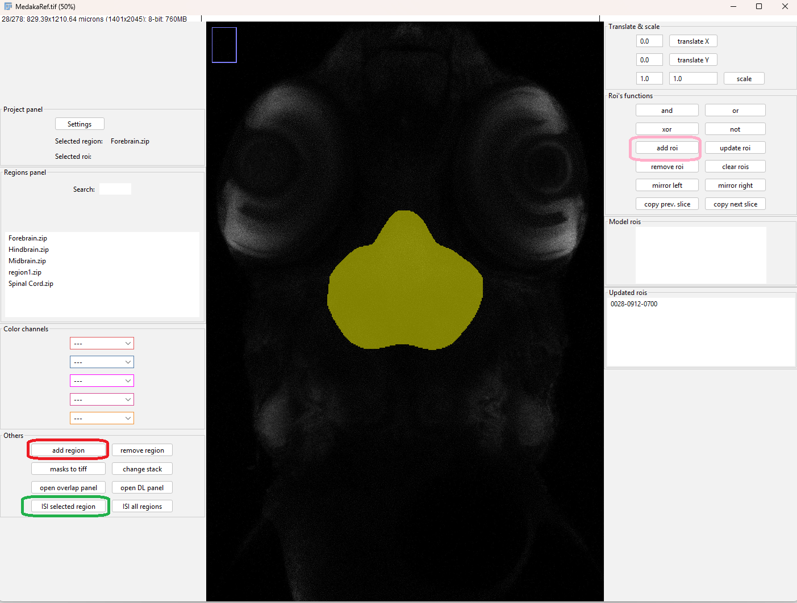

# NeMO Fiji Plugin

**Neuro Mask Organizer (NeMO)** is a Fiji plug-in for anatomical mask segmentation. **Fiji** is a widely used open-source image-processing platform in the biological sciences. NeMO enables users to manually annotate anatomical masks, compare them with registered or predicted masks, and correct overlaps between masks. The software also supports hybrid workflows that combine manual annotation with automated segmentation. It currently provides two automated approaches:.   
1. **Morphological contour interpolation**, which propagates annotations between labeled slices.
2. **Deep-learning–based segmentation**, which predicts masks from image data using trained models.

In this tutorial, we provide detailed installation instructions and a step-by-step example using a test project.

---

**System requirements**

The minimal requirements for running NeMO are:
1. Memory: 16-32 GB
2. Operating system: Windows 10+11, Linux, MacOS
3. Processor: 32-64 bit
4. Latest version of Fiji

---

**Installation instructions**

Download the “NeMO.jar” from the github repository and copy it to the Fiji “plugins” directory (encircled red in the images below).

---

**Project structure**

Download the demo project("medakasegmentation.zip") and unzip it. If you want to annotate your custom data, please download "regionssegmentation.zip" and unzip it. The project structure is shown in the image below.

One can also find a list of environments in the project JSON file. NeMO relies on Python scripts and these Conda environments to perform image registration and segmentation tasks.

To use the Morphological Contour Interpolation feature, users must first create the required Conda environment and install the necessary packages using the commands provided below.
1. conda create --name interslice
2. conda install pip
3. pip install itkwasm-morphological-contour-interpolation

Instructions for setting up and using the image registration and deep-learning–based segmentation modules will be provided in their respective tutorials.

---
Open the Fiji platform and the NeMO plugin will be enlisted in the Fiji “plugins” tab (encircled red in the image below). 

---

Click the “NeMO” button and select the project file from the unzipped test project. The project will be loaded and the NeMO window will appear on the screen as shown below.

