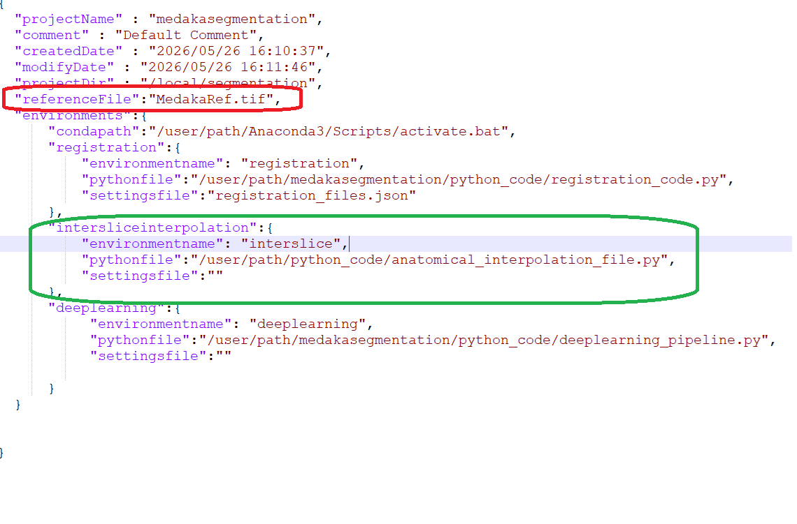
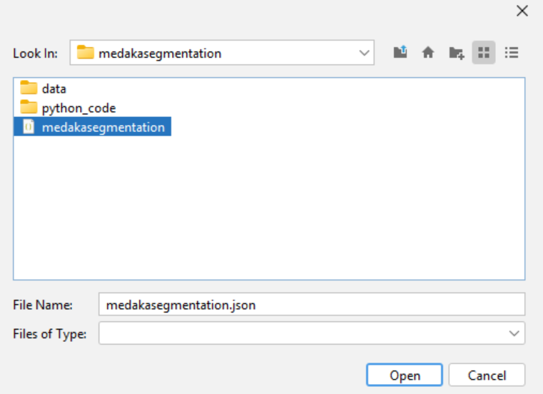

# NeMO Fiji Plugin

**Neuro Mask Organizer (NeMO)** is a Fiji plug-in for anatomical mask segmentation. **Fiji** is a widely used open-source image-processing platform in the biological sciences. NeMO enables users to manually annotate anatomical masks, compare them with registered or predicted masks, and correct overlaps between masks. The software also supports hybrid workflows that combine manual annotation with automated segmentation. It currently provides two automated approaches:.   
1. **Morphological contour interpolation**, which propagates annotations between labeled slices.
2. **Deep-learning–based segmentation**, which predicts masks from image data using trained models.

In this tutorial, we provide detailed installation instructions and a step-by-step example using a test project.

---

**System requirements**

The minimal requirements for running NeMO are:
1. Memory: 16-32 GB
2. Operating system: Windows 10+11, Linux, MacOS
3. Processor: 32-64 bit
4. Latest version of Fiji

---

**Installation instructions**

Download the “NeMO.jar” from the github repository and copy it to the Fiji “plugins” directory (encircled red in the images below).

---

**Project structure**

Download the demo project("medakasegmentation.zip") and unzip it. If you want to annotate your custom data, please download "regionssegmentation.zip" and unzip it. The project structure is shown in the image below.

The data folder contains several subfolders, each serving a specific purpose. Most of these folders are automatically managed by NeMO and are used to organize annotation data, intermediate results, model predictions, and backups.

1. **history** – Stores historical versions of the masks.
2. **interslicetiff** – Contains TIFF files generated through morphological contour interpolation.
3. **models** – Stores regions predicted by the segmentation models.
4. **regions_backup** – Contains automatically generated backups of expert-annotated regions.
5. **regions** – Stores expert-annotated regions in a compressed format.
6. **slices** – Contains the reference image stack used for annotation.
7. **tiff** – Stores the regions annotated by experts in TIFF format.

Open the project JSON file (e.g., **medakasegmentation.json**). If you would like to annotate your own dataset, first copy the reference TIFF stack into the slices folder. Then, update the **referenceFile** field in the JSON file so that it points to your reference stack, as highlighted by the red circle in the images below.

After saving the changes, the project will load your custom reference data for annotation.   

One can also find a list of environments in the project JSON file. NeMO relies on Python scripts and these Conda environments to perform image registration and segmentation tasks.

To use the **Morphological Contour Interpolation** feature, users must first create the required Conda environment and install the necessary packages using the commands provided below.

1. conda create --name interslice
2. conda install pip
3. pip install itkwasm-morphological-contour-interpolation

Please also update the path of **pythonfile** related to Morphological Contour Interpolation in the project JSON file.

Instructions for setting up and using the **image registration** and **deep-learning–based segmentation** modules will be provided in their respective tutorials.

---
Open the Fiji platform and the NeMO plugin will be enlisted in the Fiji “plugins” tab (encircled red in the image below). 

---

Click the “NeMO” button and select the project JSON file (e.g., **medakasegmentation.json**) (shown in the image below). 

The project will be loaded and the NeMO window will appear on the screen as shown below.

If you want to add new region, please click "add (encircled red in the image below).

